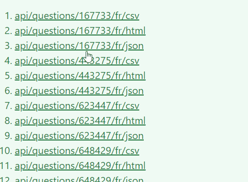

# javascript_tips

> Some tips &amp; tricks and snippets for javascript.

* [Snippets](#snippets)
  * [Change color of links when clicked](#change-color-of-links-when-clicked)
* [Author](#author)
* [License](#license)

## Snippets

### Change color of links when clicked

When a link has been clicked, change his style to make simple to visualize un visited links.

Prefer js and not css (`a:visited {color: cyan; }`) so we can simply refresh the page (JS) without having to clear the browser history (css).

Idea is to be able to detect on a page which links have been clicked.

When a link will be clicked, the `visited` class will be added to highlight the link. When a second link will be clicked, all links with class `visited` will be modified to `already_visited` so we can make a clear, visual, difference between the last clicked one and the old ones.



```css
<style>
    .visited { background-color: #ffc107; }
    .already_visited { color: #f3e3e3 !important; }
</style>
```

```javascript
<script>
document.addEventListener("DOMContentLoaded", () => {
    (
        addEventListener('click', function (ev) {

            for(var i = 0, l=document.links.length; i<l; i++) {
                if (document.links[i].classList.contains('visited')) {
                    document.links[i].classList.remove('visited');
                    document.links[i].classList.add('already_visited');
                }
            }

            ev.target.classList.add('visited');
        })
    )
});
</script>
```

## Author

Christophe Avonture

## License

[MIT](LICENSE)
